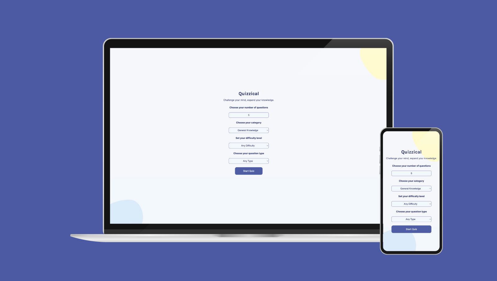
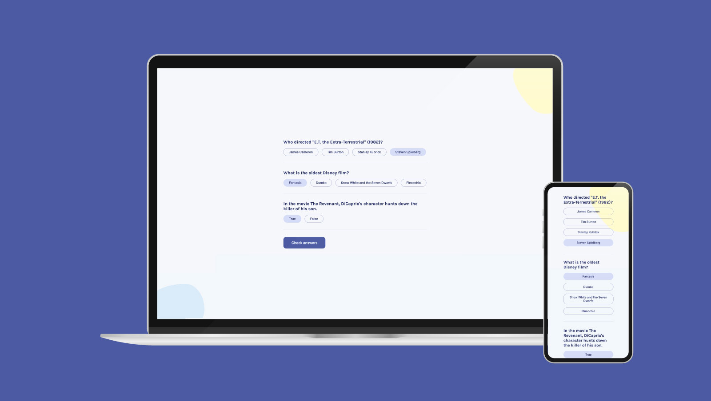
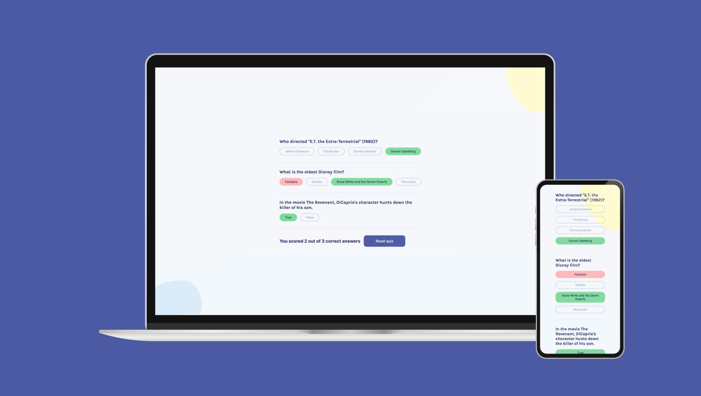

# React Quizzical Web App

## About this project

Quizzical is a React-based Quiz App that allows users to challenge their minds and expand their knowledge through a series of trivia questions. The app fetches quiz data from the Open Trivia Database API and presents users with multiple-choice or True/False questions, providing instant feedback on their answers.

Learn more about this project below 👇 

## Table of contents

- [Overview](#overview)
- [Screenshots](#screenshots)
- [How to Play](#how-to-play)
- [Features](#features)
- [Built with](#built-with)
- [My Process](#my-process)
- [How did I build it](#how-did-i-build-it)
- [What problem did I set out to fix](#what-problem-did-i-set-out-to-fix)
- [What were some of the design decisions](#what-were-some-of-the-design-decisions)
- [What I learned](#what-i-learned)
- [What I would change if I had more time](#what-i-would-change-if-i-had-more-time)
- [Contributing](#contributing)
- [Author](#author)
- [Acknowledgments](#acknowledgments)

## Overview

**Live Demo**: [https://react-quizzical-game.netlify.app/](https://react-quizzical-game.netlify.app/)

## Screenshots

### Quiz Form

### Quiz Screen

### Quiz Answers

## How to Play

- Upon launching the app, you will be presented with a form where you can customize your quiz settings.
- Choose the number of questions (1 to 50), select a category, set the difficulty level (Easy, Medium, Hard), and choose the question type (Multiple Choice or True/False).
- Click on the "Start Quiz" button to begin the quiz with your selected settings.
- You will be shown one question at a time with multiple answers.
-  Select your answer by clicking on the corresponding option.
- Continue answering questions until you've completed the quiz.
- Once you've answered all the questions, click on the "Check Answers" button to view your score.
- The app will display your quiz result, showing the number of correct answers out of the total questions.
- To start a new quiz, click on the "Reset Quiz" button.

## Features

- **Customizable quiz settings** including the number of questions, category, difficulty level, and question type.
- **Score Tracking** that allows users to keep track of their scores.
- **Responsive design** for a seamless experience on different devices.

 
## Built with

- Semantic HTML5 markup
- CSS for styling
- Flexbox
- CSS Grid
- [React](https://reactjs.org/) - JS library
- React Hooks (useState, useEffect)
- Fetch API for data retrieval from the Open Trivia Database API
- nanoid for generating unique keys
- HTML entities decoding using html-entities library

## My process

My goal for this project was to develop a small quiz web application using React. Throughout the development process, I followed these steps:

- **Design**: To create the website's design, I utilized Figma. You can find the design file [here](josh-merrill.com).
- **Code Editor**: For writing and editing the code, I relied on VSCode.
- **Version Control**: To manage the project's source code and track changes efficiently, I used Git and GitHub, which simplified my version control operations.
- **Frontend Framework**: As the foundation of this web application, I utilized React, which allowed me to build a dynamic and responsive user interface.
- **Deployment**: For deploying the web application, I chose Vite, a build tool that ensures fast and optimized development and production builds.

## How did I build it?

I built this application using HTML/CSS and React JS with Vite as the development tool. I first set up a new React project using Vite and created the main components, including Form, Quiz, Answer, and Loader. Throughout the development process, I leveraged React Hooks like useState and useEffect to efficiently manage state and handle side effects. By integrating the Open Trivia Database API, I was able to fetch quiz data based on user settings, making the app dynamic and adaptable. Additionally, I introduced user interactivity by allowing users to select answers and receive real-time feedback. After completion, the app calculates and displays the quiz results, providing users with their scores.

## What problem did I set out to fix?

The primary aim of this project was to build an engaging quiz app that provides users with an enjoyable experience while challenging their knowledge in various categories. By creating a simple and interactive web application, I aimed to offer an entertaining way for users to test their trivia knowledge.

## What were some of the design decisions?

During the development process, I made the following design decisions:

- **User-friendly Interface:** I focused on creating a clean and intuitive user interface to ensure users could easily navigate and interact with the quiz.
- **Customizability:** The app allows users to customize their quiz by selecting the number of questions, category, difficulty, and question type, giving them more control over their quiz experience.
  

## What I learned

During the development of Quizzical, I gained valuable experience and knowledge in several areas:

- **React Fundamentals:** I solidified my understanding of React components, state management using hooks, and conditional rendering.
- **Asynchronous Data Fetching:** I learned how to fetch data from an external API and handle asynchronous operations effectively.
- **CSS Styling:** The project allowed me to practice CSS styling and responsive design to create an appealing and user-friendly layout.
- **Debugging and Troubleshooting:** Throughout the development process, I encountered and resolved various issues, honing my debugging skills.

## What I would change if I had more time

Given more time, there are a few improvements and additional features I would like to implement:

- **User Authentication:** Introducing user authentication would enable users to save and review their quiz results.
- **Leaderboard:** Implementing a leaderboard system to showcase high scores and achievements among users.
- **Animations and Transitions:** Adding animations and transitions to enhance the overall user experience.

  
## Contributing

Contributions are welcome! If you find any issues or have suggestions for improvements, please feel free to open an issue or submit a pull request.

## Author

- [Josh Merrill](https://www.josh-merrill.com)
- [Github](https://github.com/josh-merrill)
- [LinkedIn](https://www.linkedin.com/in/joshmmerrill/)
- [Email](mailto:joshmmerrill@outlook.com?subject=Hello!)

  
## Acknowledgments

I would like to extend my gratitude to all the dedicated instructors at Scrimba. Their valuable teachings and inspirational solutions have been a constant source of motivation, pushing me to improve and innovate in my web development endeavors.

